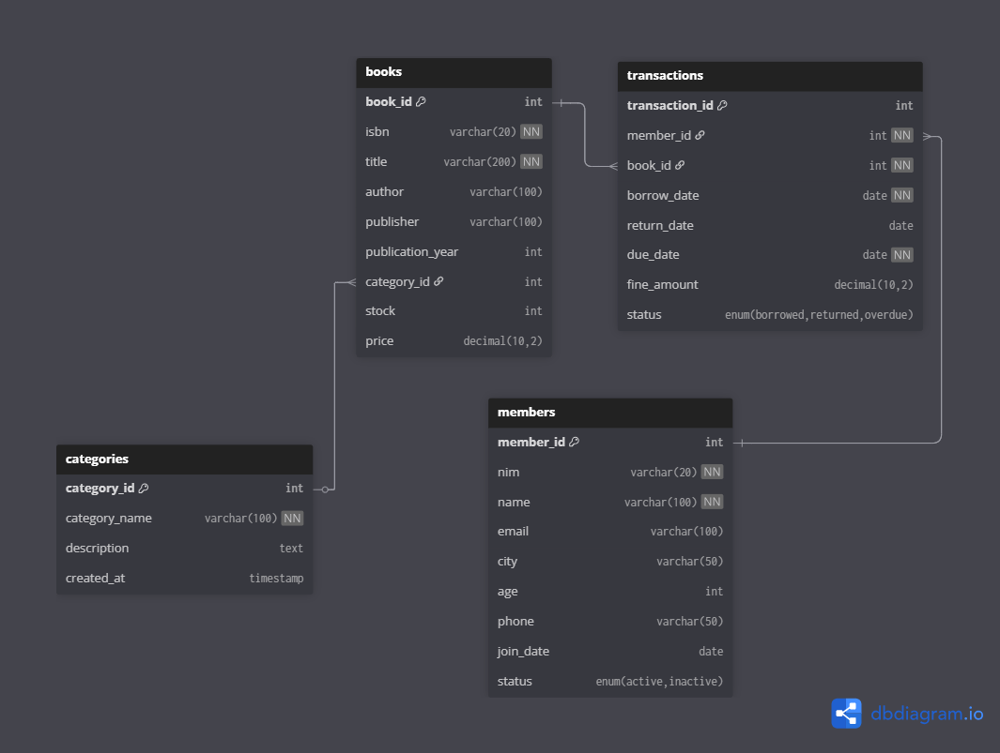

# Perpustakaan-DB

A lightweight SQL-based library management system designed to help you master relational database concepts through hands-on practice. Clean schema, realistic dummy data, and practice queries to get you started with SQL fundamentals.

## What's This?

Perpustakaan-DB is a beginner-friendly database project simulating a complete library system. The project includes 4 core tables (Categories, Books, Members, and Transactions) with proper foreign key relationships and pre-filled sample data for instant testing. You get a realistic dataset to experiment with SQL without the theory overload.

## Tech Stack

Keep it simple. No frameworks, no external dependencies. Just MySQL/MariaDB with standard SQL syntax. Works on any SQL-compatible server. Import and run.

## Getting Started

**Option 1 Import via MySQL CLI**

Clone the repository:
```bash
git clone https://github.com/sayyeone/perpustakaan-db.git
cd perpustakaan-db
```

Import the database:
```bash
mysql -u root -p < perpus_db.sql
```

**Option 2 Use a GUI Tool (recommended)**

You can also import `perpus_db.sql` using phpMyAdmin, DBeaver, HeidiSQL, or any MySQL client. Open the tool, create a new connection, import the SQL file, and you're done. The full schema and sample data will appear instantly.

## Project Structure

```
perpustakaan-db/
├── perpus_db.sql        # Main database schema + dummy data
├── queries.sql          # SQL practice queries & optimization
└── README.md            # Project documentation
```

Simple and easy to navigate.

## Query Examples & Performance Optimization

The included `queries.sql` file demonstrates SQL progression from basic to advanced concepts with real-world optimization techniques. Starting with simple pattern matching and ISBN searches, moving to complex multi-table joins for tracking overdue books with fines, then statistical aggregations for business insights like price ranges and inventory counts per category.

The highlight is the indexing strategy section where you'll learn to create composite indexes, FULLTEXT indexes for search functionality, and use `EXPLAIN ANALYZE` to measure performance improvements. This hands-on approach shows how proper indexing can dramatically speed up query execution in production environments.

## Database Schema

The database consists of 4 main tables: **categories** (book categorization), **books** (inventory), **members** (library users), and **transactions** (borrow/return records). Each table has proper foreign key relationships. Categories can have many books, members can have many transactions, and books can be borrowed multiple times.

**ERD Diagram:**



You can also view the interactive diagram on [dbdiagram.io](https://dbdiagram.io/d/perpustakaan-db-67d6a76375d75cc8443e5f21) by importing the DBML file.

## Features

Complete library schema with categories, books, members, and transactions. Includes proper foreign key relationships, realistic constraints, and ready-to-use sample data. Perfect for practicing SQL fundamentals like SELECT, JOIN, GROUP BY, and more. Beginner-friendly with clear structure and real-world scenarios.

## Use Cases

Great for learning SQL fundamentals, practicing queries with realistic data, using as a starting point for database projects, or preparing for exams. Whether you're a student working on assignments or a developer refreshing your SQL skills, this project provides a practical foundation.

## Tool Support

Works on any database environment that supports SQL. Compatible with MySQL CLI, MariaDB, phpMyAdmin, DBeaver, HeidiSQL, and local development stacks like Laragon or XAMPP.

## Contributing

Found something to improve? Fork the repo, create a feature branch, make your changes, and open a pull request. All contributions welcome.

## Credits

Created as a learning project to make relational database concepts easy to understand through clear structure and practical examples.

---

Made with ❤️ by [Sayyeone](https://github.com/sayyeone)
